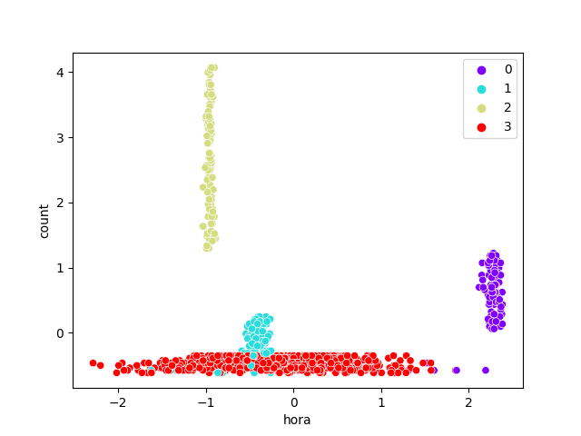

# Table of contents
1. [simparking](#simparking)
2. [Execució](#run)
3. [Docker](#docker)
4. [API](#api)
5. [Clustering](#clustering)
6. [Testing](#tests)
7. [Llicència](#licence)

# simparking <a name="simparking"></a>
**simparking** és un projecte de simulació d'entrades i sortides de cotxes en un pàrquing de la ciutat.

ENG: This is a Python project that simulates a parking car activity. 4 behaviour patterns have been coded.
The ultimate goal is to train a KMeans clustering algorythm to discover the four patterns.

Es vol crear dades sintètiques per poder fer un anàlisi de les dades amb IA (bàsicament un problema de clustering).

Consta de dues parts:

- simulaciodades: crea a la carpeta data/ dades simulades. En principi es simulen 4 comportaments de cotxes, que donaran lloc a 4 categories/clústers.
- simulacioparking: és l'aplicatiu des del punt de vista de l'operari del pàrking. Veu com entren i surten els cotxes. Contsta d'una interfície de consola, i d'una interfície gràfica.

Consta també de diferents carpetes i scripts relacionats amb l'anàlisi de les dades i la solució amb IA del problema del clustering.

# Execució <a name="run"></a>

Pots crear un entorn virtual fent:
```
$ python -m venv venv
 o bé:
$ virtualenv venv

$ source venv/bin/activate
```

i tot seguit instal·lar els mòduls necessaris:
```
$ pip install -r requirements.txt
```

Per executar:
```
$ cd simulaciodades
$ python simulaciodades.py
```

```
$ cd simulacioparking
$ python simulacioparking.py [cli | gui]
```
Utilitza l'opció <em>gui</em> per la interfície gràfica (llibreria tkinter).

# Docker <a name="docker"></a>

```
Descarrega:
$ docker pull iabdioc/simparking:latest

Crea i arrenca el contenidor:
$ docker run --name simparking -dit -p 8888:8888 -p 5000:5000 iabdioc/simparking:latest /bin/sh

  * port 8000: Jupyter
  * port 5000: REST API

Accedir al contenidor
$ docker exec -it simparking /bin/bash

Dins del contenidor pots arrencar el servidor web de Jupyter:
$ arrencar_jupyter.sh

Pots testejar un quadern de Jupyter a:
simparking/clusteringsklearn/jupyter/clusteringsklearn.ipynb
```

# API <a name="api"></a>

El model del clustering està dins la carpeta api/model. Es pot predir el tipus a què pertany un cotxe si proporcionem dades d'entrada al pàrquing del cotxe.

Per arrencar l'API tenim l'script bootstrap.sh a l'arrel del projecte. 
```
$ curl -X POST -H "Content-Type: application/json" -d '{
  "matricula": "6897 JWK",
  "registres": "3600,7.5,0.31;2000,21.0,2.88;4000,12.4,4.52;2500,11.3,6.47;800,15.0,2.63"
}' http://localhost:5000/prediccio
```
També tenim els endpoints:
```
$ curl --request GET 'http://127.0.0.1:5000/scores' --header 'Content-Type: application/json'

$ curl --request GET 'http://127.0.0.1:5000/scores/h' --header 'Content-Type: application/text'

$ curl --request GET 'http://127.0.0.1:5000/centers' --header 'Content-Type: application/json'
```
A la carpeta <em>api/clients/</em> hi ha clients .html i .py per testejar l'API.

# Clustering <a name="clustering"></a>

Dins les carpetes <em>clusteringsklearn</em> i <em>clusteringpytorch</em> es resol el problema de trobar els clústers per a les dades simulades.ç

S'obtenen 4 clústers.



# Testing <a name="tests"></a>

Des de l'arrel del projecte:
```
$ python -m unittest discover -s tests
```

# Llicència <a name="licence"></a>
Joan Quintana - IOC (2024)
Llicència MIT. [LICENSE.txt](LICENSE.txt) per més detalls


